# 第一套

## 马原

### 1-1.  从人与自然的关系角度分析什么要推动实现碳达峰、碳中和目标?

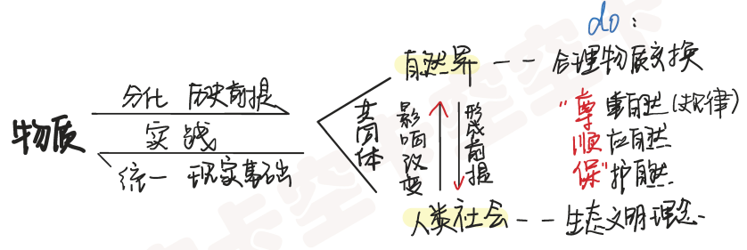

1. 原理：实践是使物质世界**分化**为自然界和人类社会的**历史前提**，又是使自然界和人类社会**统一**起来的**现实基础**。
2. 关系：自然界是人类社会形成的**前提**和自然基础，人类社会又**反过来影响**改变自然界。人与自然是生命共同体。
3. 方法论：我们必须合理地调节**人与自然的物质交换**，树立正确的**生态文明理念**；建立正确的**实践观点**，人的**实践活动**必须遵循客观规律，应该尊重自然、顺应自然和保护自然，这是实现人与自然和谐的关键。
4. 点题：推动实现碳达峰、碳中和目标，正是要合理调节人与自然的物质交换，推动实现人与自然和谐统一。

### 1-2 如何理解大自然“是人类赖以生存发展的基本条件”、生物多样性“是人类生存发展的基础”?

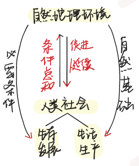

1. 自然地理环境指与人类社会所处地理位置相联系的自然条件的总和。（**定义**）
2. 自然地理环境是人们生活和生产的自然基础，提供了生活和生产资料的来源。离开一定自然条件人类就不可能生活和生产。（**基础**）
3. 自然地理环境是人类社会生存和发展永恒的、必要的条件，其优劣会对社会发展起促进或延缓作用。（发**展**）
4. 方法论：自然生态平衡对人类社会起重要作用，合理地利用自然资源，保护生态平衡，是社会得以正常发展的必要条件。

### 1-3 从辩证法的角度分析为什么要保护生物多样性?

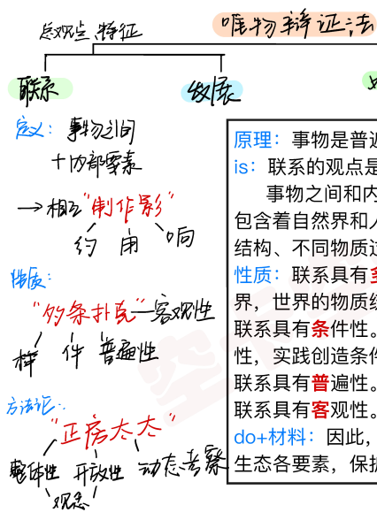

1. 原理：事物是普遍联系的。
2. 定义：
   1. 联系的观点是唯物辩证法的**总观点**和**总特征**之一。
   2. **事物**之间和**内部要素**之间都会相互**制**约、**作**用和**影**响。
   3. 物质世界包含着**自然界**和**人类社会**、不同的物质现象和形态、不同的物质层次和结构、不同物质过程和活动。
3. 性质：
   1. 联系具有**多**样性。物质世界是一个充满多样性的多姿多彩的世界，世界的物质统一性是多样性的统一。
   2. 联系具有**条**件性。人们要在尊重客观规律的前提下，发挥主观能动性，实践创造条件。
   3. 联系具有**普**遍性。万事万物处于普遍联系中。
   4. 联系具有**客**观性。事物的联系是本身固有的，不是主观臆想的。
4. 方法论+材料：因此，要用**整**体性和开**放**性的观念动**态**考察事物，统筹自然生态各要素，保护好生物多样性，才能达到人与自然的和谐。

## 毛中特

### 2-1 为什么把共同富裕放在更加重要的位置

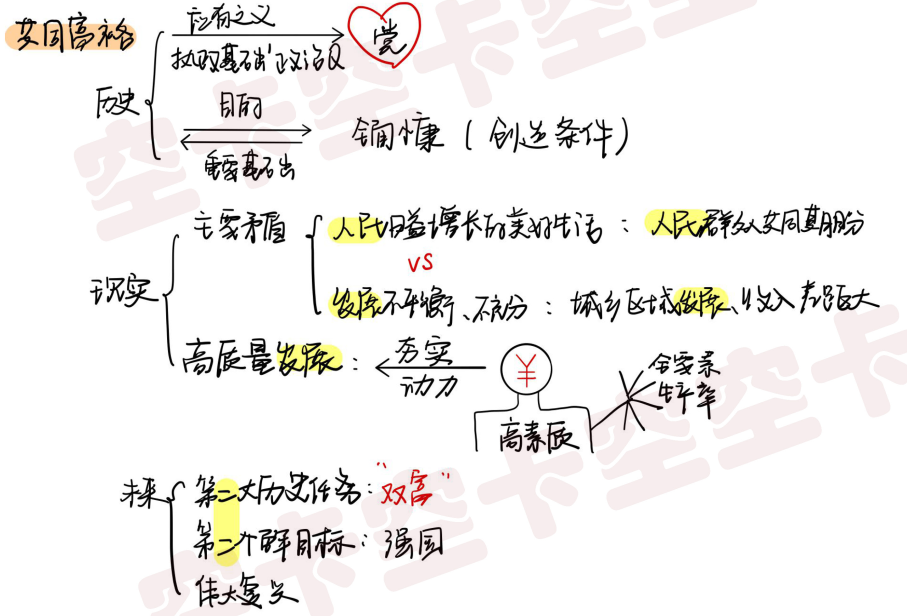

1. **理论**：是社会主义的**本质要求**，是社会主义现代化的重要目标和重要特征。
2. **历史**:
   1. **党初心使命**：第一，中国共产党一经诞生，就把为中国人民谋幸福、为中华民族谋复兴确立为初心使命，共同富裕是党的初心使命和题中应有之义，是关系党执政基础的重大政治问题。
   2. **新时代成就**：第二，中国特色社会主义进入新时代，第一个百年目标——全面建成小康社会的实现，为共同富裕创造了良好条件。
   3. **关系**：全面小康是实现共同富裕的重要基础，共同富裕是全面小康的目的。
3. **现实**：
   1. 第三，是适用我国**主要矛盾**变化的需要。
   2. **人民**：要更好满足人民日益增长的美好生活的需要，必须把“促进全体人民共同富裕”作为为人民谋幸
      福的着力点，实现共同富裕是人民群众的共同期盼。
   3. **发展**：我国发展不平衡不充分问题仍然突出，城乡区域发展和收入分配差距较大。
   4. 第四，是**高质量发展**的需要：只有促进共同富裕，提高居民收入，增加高素质劳动者，才能提高全要素生产率，夯实高质量发展的动力基础。
4. **未来目标**：
   1. 第五，要继续完成**第二大历史任务**——国家富强+人民富裕，为**第二个百年目标**——全面建成社会主义现代化强国、实现中华民族伟大复兴而奋斗，就要把共同富裕放在更重要的位置。

### 2-2 为什么要“在高质量发展中促进共同富裕”?

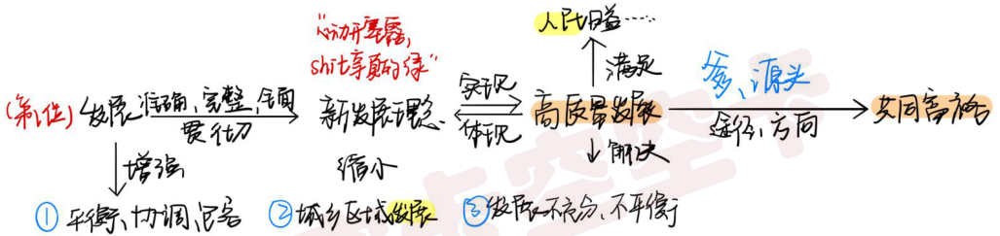

1. **是什么**：
   1. **高质量发展**是能很好满足人民日益增长的美好生活需要的发展，是体现新发展理念的发展，是“创新成为第一动力、开放成为必由之路、协调成为内生特点、共享成为根本目的、绿色成为普遍形态”的发展。(**助记**:心动开塞露，shit享真的绿）
   2. **共同富裕**是社会主义的本质要求，是社会主义现代化的重要目标和重要特征。
2. **关系**：题中“在高质量发展中促进共同富裕”，指明了共同富裕的努力**方向**和实现**途径**。
3. **一个方向**：推动共同富裕，**解决发展问题**是第一位的。新时代的**发展**必须完整、准确、全面贯彻**新发展理念**，实现**高质量发展**。没有高质量发展，就实现不了共同富裕。(**助记**:我是你爹，是源头，给你指明方向和途径)
4. **三个途径**：推动高质量发展的过程就是从**源头**上打好共同富裕**基础**的过程。要：
   1. 增强发展的**平**衡性、协**调**性、**包**容性
   2. 持续缩小**城乡区域**发展差距
   3. 解决发展**不平衡不充分**这一主要矛盾

### 2-3 如何在高质量发展中，构建体现效率、促进公平的收入分配体系，推动共同富裕?

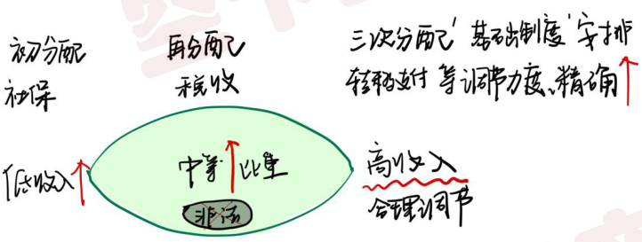

推动共同富裕：

1. 需正确处理效率和公平的关系，构建**初**次分配、**再**分配、**三**次分配**协调**配套的基础性制度安排。
2. 加大社保、税收、转移支付等**调节力度**并提高**精准性**。
3. **扩**大中等收入群体**比重**，**增**加低收入群体收入，合理**调节**高收入，**取缔**非法收入，形成中间大、两头小的橄榄型分配结构。
4. 促进人的**全面发展**，促进社会**公平正义**，使全体人民朝着共同富裕目标扎实迈进。

## 史纲

### 3-1 如何理解“过去一百年，中国共产党向人民、向历史交出了一份优异的答卷，现在又踏上了“新的赶考之路”?

【党的初心使命+过去成就+未来目标】

1. **初心使命**：第一， 从登上中国政治舞台的那一刻起， 中国共产党就始终不渝为中国人民谋幸福、为中华民族谋复兴。
2. **过去百年成就**：
   1. 100 年来， 中国共产党领导中国人民浴血奋战、百折不挠， 创造了**新民主主义革命**的伟大成就； 
   2. 自力更生、发愤图强， 创造了**社会主义革命和建设**的伟大成就； 
   3. 解放思想、 锐意进取， 创造了**改革开放和社会主义现代化建设**的伟大成就； 
   4. 自信自强、守正创新， 创造了**新时代中国特色社会主义**的伟大成就。
3. **现在**：在马克思主义的指导和中国共产党的领导下，中华民族迎来了从站起来、富起来到强起来的伟大飞跃， 实现中华民族伟大复兴进入了不可逆转的历史进程。
4. **未来目标**：第二， **全面建成小康社会**， 实现了中国现代化建设的**阶段性目标**，中华民族伟大复兴迈出了**关键一步**。 我们还必须继续**担当**历史使命， **掌握**历史主动，把中华民族伟大复兴的历史伟业推向**前进**，为实现第二个百年奋斗目标、实现中华民族伟大复兴而奋力拼搏。

### 3-2 结合中国共产党百年历史上制定的第一个、第二个历史决议对推进党和人民事业发挥的重要作用，说明制定第三个历史决议为什么“既有客观需要，也具备主观条件”?

【主观条件（前两个决议“是统领”) + 客观需要（未来目标+怎么做)】

1. **主观条件**： 我们党历来高度注重总结历史经验。 
2. 前两个**作用**：党历史上的第一个、第二个历史决议，
   1. 实事求**是**总结党的重大**历史事件和**重要**经验教训**
   2.  在重大历史关头**统**一了全党**思想**和**行动**
   3. 对推进党和人民事业发挥了重要引**领**作用。（**是统领**）
3. **客观需要**：现在， 距离第二个历史决议制定已经过去了 40 年。 40 年来， 党和国家事业大大向前发展了， 党的理论和实践也大大向前发展了。
4. 全面总结党的百年奋斗重大成就和历史经验，**怎么做**：
   1. 是**开启**全面建设社会主义现代化国家新征程、在新时代坚持和发展中国特色社会主义的需要； 
   2. **增强党**：是**增**强“四个意识” ， 坚**定**“四个自信” ， **做**到“两个维护” ， 确保全党步调一致向前进的需要； 
   3. **党的自我革命**：是推进党的**自我革命**、提高全党**斗争**本领和**应对风险**挑战能力， 永葆党的**生机活力**， 团结带领全国各族人民为实现中华民族伟大**复兴**的中国梦而继续奋斗的需要。

### 3-3 如何理解“两个确立”对新时代党和国家事业发展、对推进中华民族伟大复兴历史进程具有决定性意义"?

【重要性+展开解释两个确立】

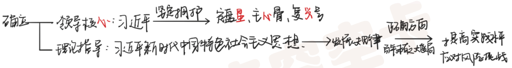

**重要性**：坚强的**领导核心**和**理论指导**是关系党和国家的**前途命运**，党和人民**事业成败**的根本性问题。

1. 一个国家、一个政党，**领导核心**至关重要。
   1. 确立习近平同志党中央的核心、全党的核心地位，是**时代**呼唤、**历史**选择、**民心**所向。
   2. 坚定拥护和维护习近平总书记的核**心**地位，全党就有定盘**星**，全国人民就有主**心**骨，中华“复**兴**”号巨轮就有掌舵者。
2. 确立习近平新时代中国特色社会主义思想的**指导**地位。
   1. 我们党就能始终**把握**发展规律
   2. 在中华民族伟大**复兴**战略全局和世界百年未有之**大变局**的复杂条件下，坚持正确前进**方向**
   3. 就能提高应对**风险挑战**的**实践**能力，带领全国各族人民开辟中华民族伟大**复兴**的光明前景。

## 思修

### 4-1 为什么要“继续弘扬光荣传统、康续红色血脉，永远把伟大建党精神继承下去、发扬光大”?

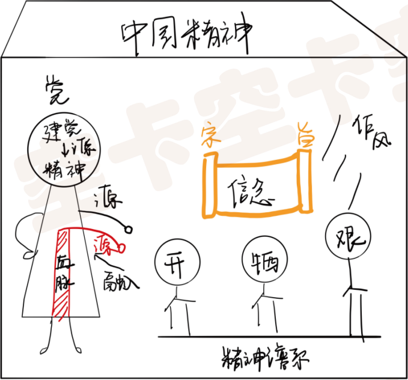

1. **过去奋斗**：**红色资源**是我们党艰辛而辉煌奋斗历程的**见证**，是最宝贵的**精神财富**。
2. **现在**：
   1. **红色血脉**是中国共产党政治本**色**的集中**体现**，是新时代中国共产党人的精神力量**源泉**。
   2. **伟大建党精神**是中国共产党的**精神之源**。以建党精神为源头形成的中国共产党人的**精神谱系**，
   3. 集中体现了党的坚定**信念**、根本**宗旨**、优良**作风**，
   4. 展示了中国共产党人崇**高**的**精神风范**，凝聚中国共产党人**开拓进取**、**牺牲奉献**、**艰苦奋斗**的伟大品格，
   5. 深深**融入**我们党、民族、人民、国家的**血脉**之中,极大丰富了**中国精神**的内涵，

3. **未来目标**：继续鼓舞和激励中国人民攻坚克难,不断从胜利走向新的胜利。

### 4-2 新时代的中国青年应当如何弘扬光荣传统、赓续红色血脉，继承、发扬光大伟大建党精神，“让青春在为祖国、为民族、为人民的不懈奋斗中绽放绚丽之花”?

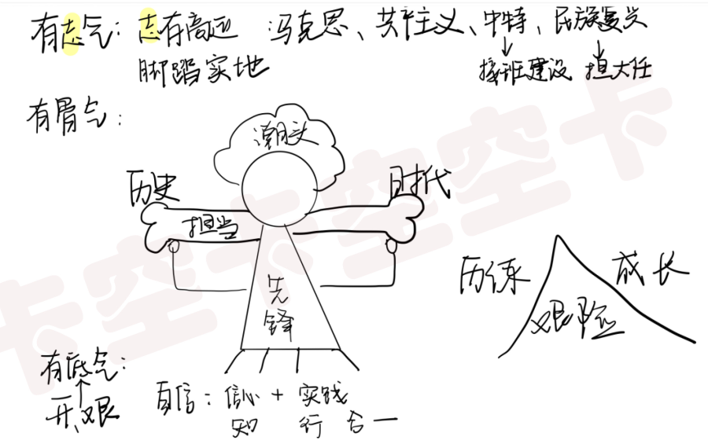

**抄题**：作为当代青年，应该弘扬光荣传统、充分利用好红色资源、赓续红色血脉，继承、发扬光大伟大建党精神。

1. 要坚定理想信念，做**有志气**的新时代青年。
   1. 新时代中国青年要树立对**马**克思主义的**信仰**、对**中**国**特**色社会主义的**信念**、对中华民族伟大**复兴**中国梦的**信心**，
   2. 把立大志、明大德，成大才、担大任作为**人生追求**，努力成为社会主义的**建设者**和**接班人**,成为担当民族复兴大任的时代新人。

2. 要勇立**潮头**，争做**先锋**，敢于**担当**，做**有骨气**的新时代青年。**抄题**：弘扬优良传统，赓续红色血脉，
   1. **肩**负起**历史**与**时代**赋予的使命，不畏**艰难险阻**，在**担当**中历练，在尽责中**成长**。【历练】
   2. 树立**积极**面对、主动进取的**人生态度**。【态度】
   3. 要做**奋斗**者，在奋斗中创造幸福人生，把人生理想**融入**国家和民族的事业中。【奋斗】
3. 坚定四个自信，做**有底气**的新时代青年。
   1. 实现中华民族伟大复兴进入了不可逆转的历史进程。
   2. 底气源于**顽强拼搏**、**开拓进取**。
   3. 要立鸿鹄**志**，做**奋斗**者，肩负**历史**使命，坚定前进**信心**，自觉躬身**实践**，**知行合一**，为实现中国梦注入青春能量。

### 4-3 为什么必须旗帜鲜明反对历史虚无主义?

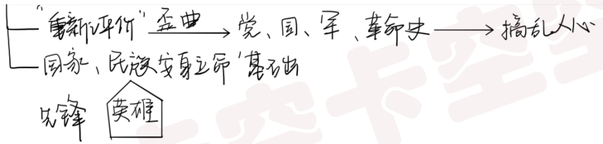

**是什么**：**历史虚无主义**以所谓“**重新评价**”为名，歪曲近现代**党**史、**国**史、**军**史、中国**革命**历史，根本目的就是要**搞乱人心**。
**为什么**：历史、英雄很重要。

1. **历史**是一个国家、一个民族安身立命的**基础**，抛弃传统、丢掉根本，就等于割断了自己的**精神命脉**
2. **英雄**是民族最闪亮的**坐标**，一个有**希望**的民族不能没有英雄，一个有**前途**的国家不能没有**先锋**。

## 时政

### 5-1 为什么说“‘有选择的多边主义’不应成为我们的选择”

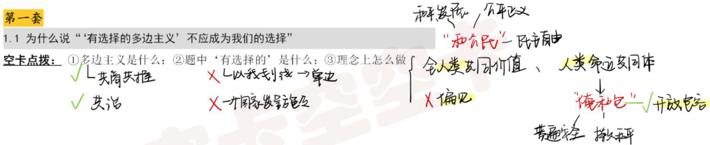

1. 多边主义是什么：多边主义的**要义**是国际上的事由大家共同**商量**着办，世界前途**命运**由各国**共同**掌握，它离不开**联合国**，离不开**国际法**，离不开**各国合作**。
2. 有选择的多边主义是什么：“有选择的多边主义”是以我划线，实质是**单边**主义。
3. 国际社会应该按照各国**共同达成**的规则和共识来治理而不能由一个或几个国家来**发号施令**。
4. **怎么做**：坚守**和**平、发展、**公**平、正义、**民**主、自由的全人类共同价值，秉持人类命运共同体理念，【和公民】
5. **偏见**—**开放包容**：摆脱意识形态**偏见**，最大程度增强**合作**机制、理念、政策的**开**放性和**包**容性，共同维护世界和平稳定，这才是真正践行多边主义。

### 5-2 如何完善全球治理，践行真正的多边主义?

【①怎么维护联合国;②联合国怎么做;】

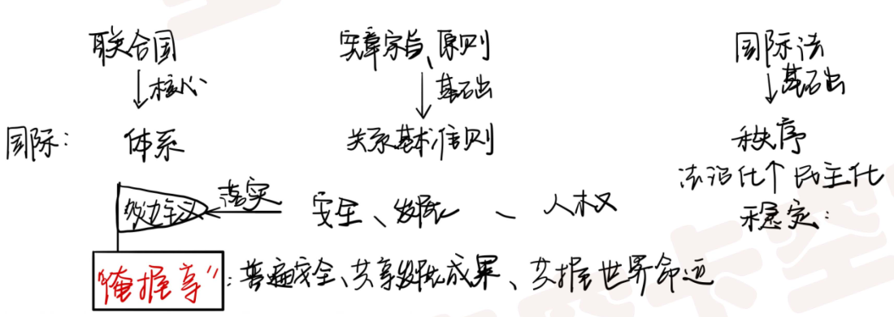

1. **怎么维护联合国**：

   1. 要维护以联合国为核心的国际**体系**；
   1. 维护以联合国**宪章宗旨**和**原则**为基础的国际**关系**基本准则；
   1. 维护以国际法为基础的国际**秩序**；

2. **联合国怎么做**：【举旗帜+建平台】

   ​	联合国应该高举真正的多边主义**旗帜**，成为各国共同维护普遍安**全**、共同分**享**发展成果、共同掌**握**世界命运的核心平台。

   1. 第一，要致力于稳定**国际秩序**，提升广大**发展中国家**在国际事务中的代表性和发言权，在推动国际关系**民**主化和**法**治化方面走在前列；
   1. 第二，要平衡推进**安**全、发**展**、**人**权三大领域工作，重在采取行动，把各方对多边主义的承诺落到实处。

### 5-3 为什么说"如果没有中美合作，多边主义是不完整的”，“未来50年，国际关系中最重要的事情是中美必须找到正确的相处之道"?

【①多边主义是什么;②中美是什么，都是大哥，合作有好处;③相处原则:想和共合共】

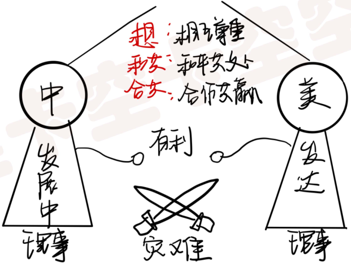

1. 真正的多边主义离不开联合国，离不开国际法，离不开各国合作。
2. 中、美**是什么**：中、美分别是最大的**发展**中国家和最大的**发达**国家，是世界第一和第二大经济体，且都是联合国安理会常任理事国和当代国际体系的重要参与者。
3. **合作好处**：中美合作可以办成许多**有利**于两国和世界的大事，中美对抗对两国和世界肯定是一场**灾难**。一个健康稳定的中美关系不仅符合**双方利益**，也是国际社会的**共同期盼**。
4. **抄题**:未来 50年，国际关系中最重要的事情是中美必须找到正确的相处之道。
5. 具体**相处之道**：新时期中美相处应该坚持3点原则:一是相互尊重;二是和平共处;三是合作共赢。（**想和共合共**）

# 第二套

## 马原

### 1-1 运用唯物史观原理,分析“江山就是人民、人民就是江山”。

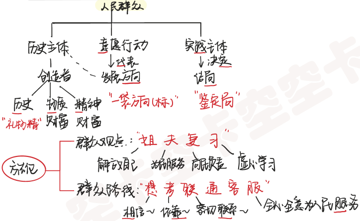

1. 人民群众作为**历史主体**，创造了**历**史、**物**质财富和**精**神财富。【礼物精】
2. 人民群众的总体**意**愿和行动**代**表了历史的发展**方向**。【一袋方向标】
3. 人民群众作为实**践**主体，决**定**最终历史发展的结**局**。【鉴定局】
4. 抄题 “江山就是人民，人民就是江山”体现了**以人民为中心**的发展思想。
5. 方法论：唯物史观要求我们
   1. 应该保持**群众观点**：**解**放自己、为民**服**务、向民**负**责、虚心学**习**，【姐夫复习】
   2. 更应走**群众路线**：**相**信人民、依**靠**人民、密切**联**系人民、全心全意为人民**服**务。【想考联通客服】

### 1-2 “以史为鉴，可以知兴替”"用历史映照现实、远观未来”体现怎样的历史思维?

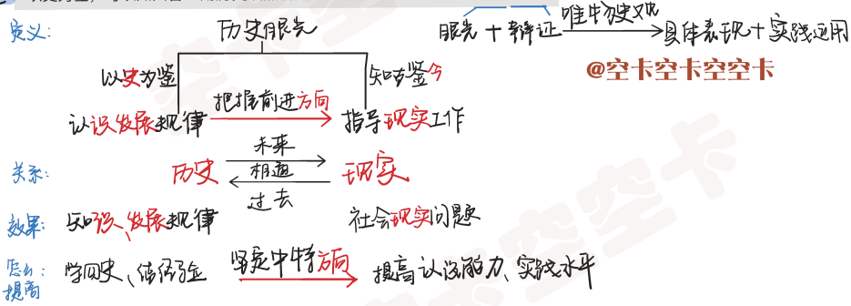

1. **定义**：**历史思维**能力是历史**眼光**与**辩证**思维的结合，是**唯物史观**的**具体表现**和**实践应用**，是以**史**为鉴、知古鉴**今**，用历史眼光认**识发展**规律、把握前进**方向**、指导**现实**工作的能力。
2. **关系**：**历史**是过去的**现实**，**现实**是**未来**的历史，历史、现实、未来是相通的。
3. **效果**：
   1. **历史**方面：历史思维能力使人正确理解和掌握历史知**识**，认识历史**发展**规律。
   2. **现实**方面：进而对社会**现实**问题进行科学思考。
4. **方法论**：
   1. 系统**学**习党、新中国、改革开放、社会主义发展**史**，总**结**历史**经验**；
   2. **坚定**中国特色社会主义**方向**；
   3. 不断提高**认识能力**和**实践水平**。

### 1-3 结合“要旗帜鲜明反对历史虚无主义”，分析说明如何用正确的历史观评价历史人物。

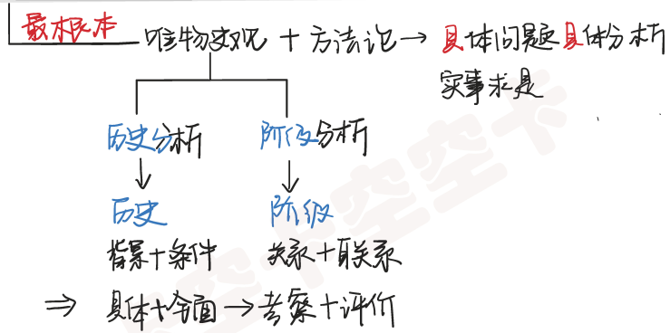

旗帜鲜明反对历史虚无主义，
①最根本的是运用唯物史观及其方法论，坚持具体问题具体分析，实事求是。②唯物史观主张:评价历史人物应坚持历史分析法和阶级分析法。
⑴历史分析法要求结合特定的历史背景和当时的历史条件，对历史人物的是非功过进行具体、全面的考察和评价。
(⑵阶级分析法要求把历史人物置于一定阶级关系中，联系其所属阶级，加以考察和评价。抄题:这样才能用正确的历史观评价历史人物。

## 毛中特

### 2-1

### 2-2

### 2-3

## 史纲

### 3-1

### 3-2

### 3-3

## 思修

### 4-1

### 4-2

### 4-3

## 时政

### 5-1

### 5-2

### 5-3